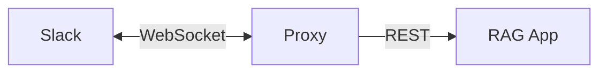

# slack-bot-sample

Slack Bot のサンプル。

## 構成



## Requirements

- Python 3.12+
- [uv](https://github.com/astral-sh/uv)

## Environment

```bash
touch .env
```

`.env` ファイルに以下の環境変数を設定してください。

- SLACK_BOT_TOKEN: SlackのBot Token
- SLACK_APP_TOKEN: SlackのApp Token
- RAG_APP_API_KEY: RAGアプリケーションのAPI Key
- RAG_APP_ID: RAGアプリケーションのAPP ID


## Setup

```bash
uv sync
```

## Run

```bash
uv run app.py
```
